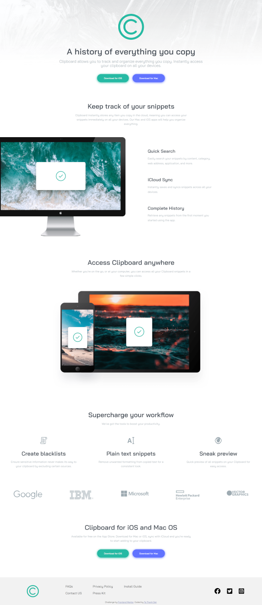
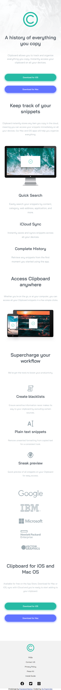

# Frontend Mentor - Clipboard landing page solution

This is a solution to the [Clipboard landing page challenge on Frontend Mentor](https://www.frontendmentor.io/challenges/clipboard-landing-page-5cc9bccd6c4c91111378ecb9). Frontend Mentor challenges help you improve your coding skills by building realistic projects.

### The challenge

Users should be able to:

-   View the optimal layout for the site depending on their device's screen size
-   See hover states for all interactive elements on the page

### Screenshot

-   Desktop Version

-   Mobile Version

### Links

-   [Live site URL ](https://your-live-site-url.com)

### Built with

-   Semantic HTML5 markup
-   CSS custom properties
-   Flexbox
-   CSS Grid

## Author

-   Facebook - [Ta Thanh Dat](https://www.facebook.com/tathanh.dat.5/)
-   Frontend Mentor - [@Ta Thanh Dat](https://www.frontendmentor.io/profile/tathanhdat)
